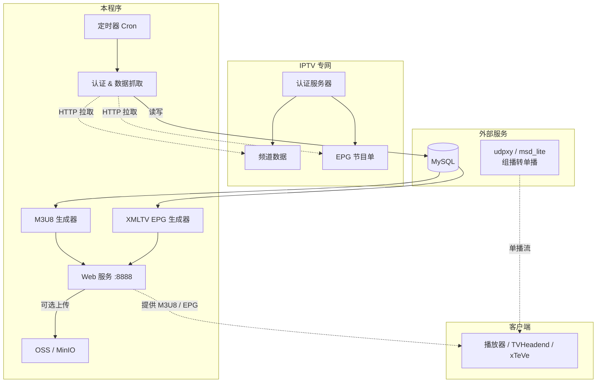

<div align="center">


</div>

# 📺 sh-tel-iptv-spider


上海电信 IPTV 抓取程序 —— 自动抓取 **EPG 节目单** 与 **M3U8 播放地址**，并写入 MySQL。

---

## ⚠️ 使用须知

> 🔒 **请务必遵守以下规则，否则将停止维护。**
   本软件完全免费，如果你付费购买，请告诉我。并且立即退款
- ❌ **禁止商业化**：不得用于闲鱼、公司等盈利服务，包括代安装、代理服务
- ❌ **禁止宣传**：不得在任何平台（小红书、论坛、QQ 群等）宣传本项目或贴链接
- 🤫 **低调使用，请勿张扬**
- 📌 唯一授权发布：**恩山论坛 - 公子薛**
- 📌 使用本程序需要一定技术水平，伸手党、白痴问题一律无视

---

## 📋 环境要求

| 依赖 | 说明 |
|------|------|
| 上海电信 IPTV 机顶盒 | 已开通 IPTV 服务，获取机顶盒账号 |
| MySQL 数据库 | 存储频道、EPG、认证信息 |
| IPTV 专网访问 | 需解决路由，确保能访问专网 |

> ⚠️ **重要**：程序必须在能访问 IPTV 专网的环境运行，公网无法抓取。回放地址与鉴权绑定，仅限本人使用。

---

## 🚀 快速开始

### 下载二进制

| 文件 | 平台 |
|------|------|
| `sh-tel-iptv-spider_linux_386` | Linux x86 32位 |
| `sh-tel-iptv-spider_linux_amd64` | Linux x86 64位 |
| `sh-tel-iptv-spider_linux_arm` | Linux ARM 32位 |
| `sh-tel-iptv-spider_linux_arm64` | Linux ARM 64位 |
| `sh-tel-iptv-spider_windows_386.exe` | Windows 32位 |
| `sh-tel-iptv-spider_windows_amd64.exe` | Windows 64位 |

### OpenWrt 用户

```bash
# 安装时区数据（OpenWrt 默认缺少）
opkg update
opkg install zoneinfo-asia
ln -sf /usr/share/zoneinfo/Asia/Shanghai /etc/localtime

# 运行（根据平台选择对应二进制）
./sh-tel-iptv-spider_linux_amd64
```

### OpenWrt 后台常驻（procd）

创建服务脚本 `/etc/init.d/iptv-spider`：

```bash
#!/bin/sh /etc/rc.common

START=99
USE_PROCD=1

PROG=/root/sh-tel-iptv-spider_linux_amd64
CONFIG=/root/config.yaml

start_service() {
    procd_open_instance
    procd_set_param command "$PROG" -c "$CONFIG"
    procd_set_param respawn          # 进程挂了自动重启
    procd_set_param stdout 1         # 输出到 logread
    procd_set_param stderr 1
    procd_close_instance
}
```

然后：

```bash
chmod +x /etc/init.d/iptv-spider
/etc/init.d/iptv-spider enable    # 开机自启
/etc/init.d/iptv-spider start     # 立即启动
```

常用管理命令：

```bash
/etc/init.d/iptv-spider status    # 查看运行状态
/etc/init.d/iptv-spider restart   # 重启服务
/etc/init.d/iptv-spider stop      # 停止服务
logread | grep iptv-spider        # 查看日志
```

### 配置文件

编辑 `config.yaml`，填入 MySQL 连接信息、IPTV 认证参数以及自定义频道映射，启动即可。

---

## ⚙️ 功能说明

- **语言**：Go，编译为单一可执行文件
- **跨平台**：Linux / OpenWrt / Windows

| 功能 | 说明 |
|------|------|
| 📡 频道列表 | 自动抓取 IPTV 频道信息 |
| 📅 EPG 节目单 | 抓取节目数据并入库 |
| 🎬 M3U8 地址 | 生成播放列表，支持自定义频道映射 |
| 🗄️ 数据持久化 | 全部写入 MySQL 数据库 |
| 🌐 Web 监控 | 内置管理面板，支持频道管理、EPG 配置、日志查看 |
| 📡 API 接口 | 完整 REST API，详见 [API.md](API.md) |
| 🔍 专网 IP 检测 | 可选：SSH 连接 OpenWrt 自动检测 IPTV 专网 IP 变化并重认证 |

---

## 📂 数据库结构

| 表名 | 说明 |
|------|------|
| `auth_infos` | 认证鉴权存储 |
| `channel_infos` | 频道列表 |
| `channels` | 频道源地址 |
| `epg_details` | 节目单详情 |
| `epg_configs` | EPG 配置（单行） |
| `m3u8_mappings` | 频道分组映射 |

> 建表 SQL 请查看源码。

---

## 📖 使用手册

### 🏗️ 配置文件详解

程序启动需要 `config.yaml`，以下为完整配置说明：

#### 基础服务

| 字段 | 默认值 | 说明 |
|------|--------|------|
| `system.env` | `public` | 运行环境，`public` 表示生产模式 |
| `system.addr` | `0.0.0.0:8888` | 监听地址 |
| `system.db-type` | `mysql` | 数据库类型，目前仅支持 MySQL |

#### 机顶盒认证 (`stb`)

| 字段 | 说明 | 获取方式 |
|------|------|----------|
| `stb.uid` | IPTV 账号 | 机顶盒 → 设置 → 用户信息 |
| `stb.mac` | 机顶盒 MAC 地址 | 机顶盒背面标签 或 路由器 DHCP 列表 |
| `stb.sn` | 机顶盒序列号 | 机顶盒背面标签 |
| `stb.ip` | IPTV 专网 IP | 机顶盒网络状态页面，通常 `30.x.x.x` 网段 |
| `stb.type` | 机顶盒型号 | `B860` 等，一般无需修改 |
| `stb.auth_host` | 认证服务器地址 | 一般无需修改 |

> 💡 **提示**：以上 6 个字段填错任何一个都会导致认证失败，无法抓取数据。

#### OpenWrt 专网 IP 检测（可选）

如果你的设备通过 OpenWrt 路由器接入 IPTV 专网，配置以下字段后，程序会每 5 分钟 SSH 到路由器检测专网 IP 是否变化，变化时**自动重认证**，无需手动重启。

| 字段 | 默认值 | 说明 |
|------|--------|------|
| `stb.openwrt_host` | （空） | OpenWrt 路由器 IP，如 `192.168.1.1` |
| `stb.openwrt_port` | `22` | SSH 端口 |
| `stb.openwrt_user` | `root` | SSH 用户名 |
| `stb.openwrt_pass` | （空） | SSH 密码 |
| `stb.openwrt_if` | （空） | IPTV 专网接口名，如 `wan.85`、`iptv`、`pppoe-iptv` |

> 不填 OpenWrt 配置不影响正常使用，程序会跳过 IP 检测。

#### MySQL 数据库 (`mysql`)

| 字段 | 说明 |
|------|------|
| `path` | 数据库地址，格式 `IP:端口` |
| `db-name` | 数据库名（需提前创建） |
| `username` / `password` | 数据库账号密码 |

#### EPG / 回放配置 (`epg`)

| 字段 | 默认值 | 说明 |
|------|--------|------|
| `generator` | `Deny` | XMLTV 生成器名称 |
| `source` | `Shanghai Telecom Iptv Spider` | XMLTV 数据源名称 |
| `xml_url` | — | M3U 头部中的 EPG 地址（`tvg-url`） |
| `rtp_url` | `http://127.0.0.1:5140/rtp/` | **直播流**代理前缀（组播转单播） |
| `rtsp_url` | `http://127.0.0.1:5140/rtsp/` | **回放流**代理前缀（时移/回看） |
| `logo_url` | — | 频道图标前缀地址 |
| `fetch_cron` | `0 0 9,17,22 * * *` | EPG 自动抓取 Cron 表达式 |
| `playseek` | `&playseek={utc:YmdHMS}-{utcend:YmdHMS}` | 时移回看 URL 参数模板 |

> 💡 **首次启动**：从 `config.yaml` 读取并写入数据库。**后续启动**：以数据库中的值为准，config.yaml 不会覆盖。运行中可通过 Web 界面 `http://IP:8888` → EPG 设置 或 API `/api/epg/config` 实时修改，立即生效无需重启。

#### 对象存储 (`oss`)

| 字段 | 说明 |
|------|------|
| `enable` | 是否启用 OSS 上传（`true` / `false`） |
| `upload_cron` | M3U8 文件自动上传 Cron 表达式 |
| `endpoint` / `bucket` / `access-key` / `secret-key` | OSS 服务商参数，支持 COS 和 MinIO |

#### 缓存 (`cache`)

| 字段 | 说明 |
|------|------|
| `type` | `memory`（内存缓存）或 `redis`（Redis 缓存） |
| `default_timeout` | 缓存过期时间（分钟），默认 240 分钟 |

---

### 🌐 Web 管理界面

程序启动后，在浏览器访问 `http://IP:8888/api/status.html` 进入管理面板，单个页面集成了全部功能：

| 功能模块 | 说明 |
|----------|------|
| 系统状态 | 数据库连接、认证会话、下次拉取时间 |
| 频道列表 | 搜索、排序、HD/4K 标签、EPG 状态，点击频道名查看 M3U8 |
| 频道管理 | 显隐切换、重命名、拖拽排序、自定义频道增删改 |
| EPG 配置 | 在线修改 RTSP/RTP/Playseek/Cron/Logo URL |
| 网络检查 | 外网 + IPTV 专网连通性测试（实时终端输出） |
| 触发更新 | 手动触发频道+节目单更新（实时终端输出） |
| 实时日志 | SSE 实时查看后台日志流、升级日志 |
| 版本更新 | 自动检查 GitHub 更新，一键在线升级 |
| 暗黑模式 | 主题切换，偏好记忆到 localStorage |

---

### 📺 M3U8 播放列表

程序根据请求参数输出不同格式的播放列表，覆盖常见播放场景。

#### 三种输出模式

| 模式 | 请求地址 | 输出格式 | 适用播放器 |
|------|----------|----------|------------|
| **RTP 直播** | `/api/m3u8` | `http://代理:5140/rtp/233.x.x.x:5140?fcc=...` | VLC / PotPlayer / Kodi / IPTV Pro |
| **xTeVe 模式** | `/api/m3u8?xteve=true` | `udp://@233.x.x.x:5140` | xTeVe / Threadfin（直接组播） |
| **UDPXY 代理** | `/api/m3u8?udpxy=IP:PORT` | `http://IP:PORT/udp/233.x.x.x:5140` | 任意播放器（经 udpxy 转单播） |

#### 参数说明

| 参数 | 必填 | 说明 |
|------|:--:|------|
| `xteve` | 否 | 设为 `true` 输出 xTeVe 兼容格式 |
| `udpxy` | 否 | udpxy 服务地址，格式 `IP:PORT`，如 `192.168.1.1:4022` |
| `ref` | 否 | 设为 `true` 跳过缓存强制重新生成 |

#### 搭配播放器使用示例

**VLC / PotPlayer**：打开网络串流，填入
```
http://192.168.1.x:8888/api/m3u8?udpxy=192.168.1.x:4022
```

**xTeVe**：在 M3U 源填入
```
http://192.168.1.x:8888/api/m3u8?xteve=true
```
EPG 源填入
```
http://192.168.1.x:8888/api/epg
```

**TVHeadend / Emby / Jellyfin**：使用 RTP 模式（需配合 udpxy 或 msd_lite）

#### 带时移回放的频道

在 M3U8 中，支持回放的频道会携带额外标签：
```m3u
#EXTINF:-1 tvg-id="cctv1" catchup="default"
catchup-source="http://127.0.0.1:5140/rtsp/10.x.x.x:554/live/cctv1&playseek={utc:YmdHMS}-{utcend:YmdHMS}"
...
```
播放器通过 `catchup-source` 字段获取回放地址，实现时移回看。

---

### 📅 EPG 节目单

| 接口 | 方法 | 说明 |
|------|------|------|
| `/api/epg` | GET | 输出 XMLTV 标准格式节目单 |
| `/api/epg/config` | GET | 查看当前 EPG 抓取配置 |
| `/api/epg/config` | POST | 修改 EPG 配置（Cron 表达式等） |

程序支持**热更新 EPG 定时规则**，通过 Web 界面或 API 修改后立即生效，无需重启。

---

### 🔧 频道管理

通过 Web 界面或 API，可以灵活管理频道列表：

| 功能 | API | 说明 |
|------|-----|------|
| 频道列表 | `GET /api/channel/list` | 获取全部频道（含映射名称、显示状态、排序字段） |
| 显隐切换 | `POST /api/channel/toggle` | 切换频道的 `is_show` 状态，隐藏后不出现在 M3U8 中 |
| 重命名 | `POST /api/channel/rename` | 自定义频道在播放列表中的显示名称 |
| 排序 | `POST /api/channel/sort` | 调整 `sort_order`，数字越小越靠前 |
| 自定义添加 | `POST /api/channel/custom/add` | 添加自定义频道到映射表 |
| 自定义删除 | `POST /api/channel/custom/delete` | 删除自定义频道 |

> 💡 完整 API 文档见 [API.md](API.md)

---

### 🐛 常见问题

<details>
<summary><b>Q: 程序启动后提示认证失败？</b></summary>

检查 `config.yaml` 中 `stb` 部分的 6 个字段：
- `uid` 格式：`数字@etv1`
- `mac` 格式：`XX:XX:XX:XX:XX:XX`（全大写）
- `sn` 与机顶盒背面一致
- `ip` 为机顶盒获取的 IPTV 专网 IP（`30.x.x.x` 网段）
- 确保运行环境能访问 `auth_host` 指定的认证服务器
</details>

<details>
<summary><b>Q: M3U8 里频道数为 0？</b></summary>

说明频道列表尚未抓取成功。可能原因：
1. 认证失败（见上一条）
2. 认证会话过期 — 程序会自动重试，等待 1-2 分钟即可
3. 专网不通 — 确认运行环境可以访问 IPTV 专网
</details>

<details>
<summary><b>Q: 播放器能加载频道但无法播放？</b></summary>

组播无法直接跨网段传输。解决方案：
1. 部署 **udpxy**：将组播转为 HTTP 单播
2. M3U8 地址加上 `?udpxy=udpxyIP:端口` 参数
3. 或使用 **xTeVe/Threadfin**：支持直接接收组播流
</details>

<details>
<summary><b>Q: 回放/时移不生效？</b></summary>

1. 并非所有频道都支持回放，仅部分频道有 `TimeShiftURL` 字段
2. 确认 `epg.rtsp_url` 配置正确（默认为 `http://127.0.0.1:5140/rtsp/`）
3. 需要部署 RTSP 代理（如 **StreamRIP** 等）将 RTSP 流转为 HTTP
</details>

<details>
<summary><b>Q: 如何升级程序？</b></summary>

```bash
# 通过 API 远程升级（限内网使用）
curl http://127.0.0.1:8888/api/self-upgrade

# 或手动替换二进制文件后重启
```
</details>

<details>
<summary><b>Q: OpenWrt 上运行报 "no timezone" 错误？</b></summary>

```bash
opkg update
opkg install zoneinfo-asia
ln -sf /usr/share/zoneinfo/Asia/Shanghai /etc/localtime
```
</details>

---

### 🗺️ 架构一览



---

## ⚠️ 限制

- ✅ 仅支持 **上海电信 IPTV**
- ❌ 不支持其他地区电信 / 联通 / 移动

---

## 🤝 贡献

代码写得比较随意 😅，欢迎：

- Fork 项目
- 提交 PR
- 提出 Issue

---

## 📄 免责声明

1. 本程序仅供学习与研究使用
2. 禁止用于商业用途
3. 使用本程序产生的任何法律问题与作者无关
4. 使用即表示同意自行承担风险
